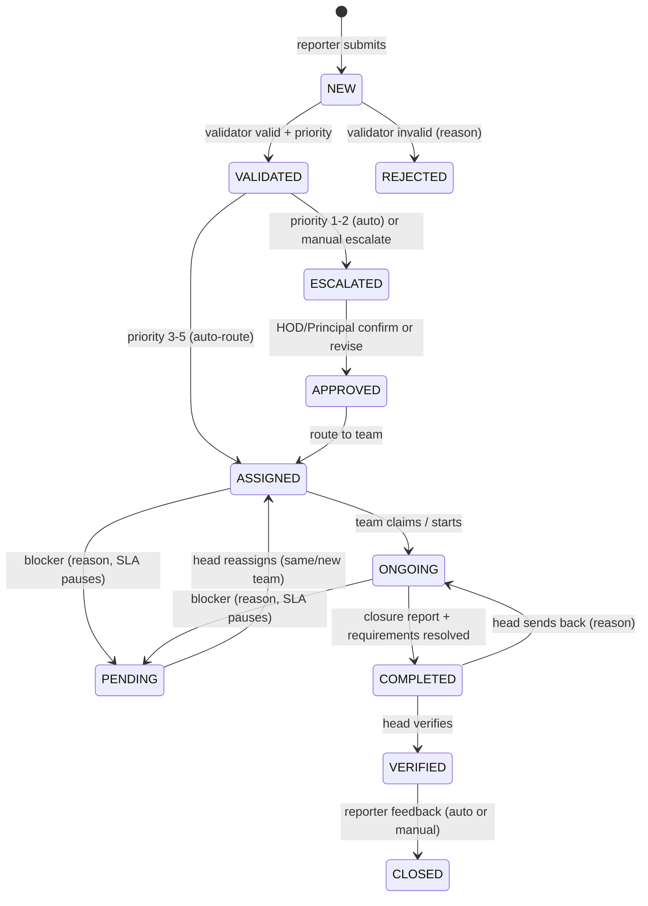

# Campus Maintenance Complaint Management — Technical Spec (v3.0)

**Stack:** Next.js (App Router) · Firebase Auth · Firestore (image blobs) · Firebase Cloud Functions · **Google Genkit AI** · real Firebase project (cloud)
**Code generation:** opencode, driven by this SPEC + `AGENTS.md`

---

## Table of Contents
1. Product Overview
2. Locked Decisions
3. Status Lifecycle (State Machine)
4. Data Model (Firestore)
5. Role × Permission Matrix
6. Routing & Assignment
7. SLA Design
8. API Routes
9. Cloud Functions
10. Notification Matrix
11. Firebase Security Rules
12. Dashboard Architecture (4 Dashboards)
13. Screen Map
14. Genkit AI Integration (5 Features)
15. opencode Build Plan
16. Remaining Optional Gaps

---

## 1. Product Overview

Closed-loop complaint management for a campus. A reporter raises an issue → a department validator screens it → HOD/Principal confirms critical severities → the right maintenance team executes → the Maintenance Head verifies → the reporter rates and it closes. Every step is audited on a timeline, SLAs are enforced per priority, and real-time updates stream via Firestore.

The app is organized around **4 dashboards** — one per stakeholder group (User, Department, HOD/Principal, Maintenance Category) — so every role lands on a home screen optimized for what they do.

**Core design principle:** *AI suggests, the state machine decides.* AI never moves a ticket, never approves, never skips a human. All AI output flows through the same route handlers as human actions and always requires human confirmation.

### 1.1 Actors / Roles

| Role | Responsibility |
|---|---|
| Reporter (student/staff/faculty) | Raises the issue, tracks it, gives feedback |
| Dept Validator | Reviews incoming issues, marks Valid/Invalid, sets initial priority (1–5) |
| HOD / Principal | Reviews & revises severity for high-priority (1 & 2) issues |
| Maintenance Team (House Keeping, Electrical, Plumbing, General, IT) | Executes the work |
| Maintenance Head / Supervisor | Routes & assigns work, verifies completed work before closure |
| Admin | Manages users, teams, categories, config, analytics |

Role enum: `reporter | validator | hod | principal | maintenance | head | admin`

---

## 2. Locked Decisions (Assumptions Resolved)

| # | Question | Decision |
|---|---|---|
| 1 | Priority direction | **1 = most urgent/critical, 5 = least urgent** |
| 2 | Invalid issue endpoint | `REJECTED` (terminal) with **mandatory** `rejection.reason` + notification to reporter |
| 3 | Category list | Configurable Firestore collection, **not** a hardcoded enum (Admin CRUD, `isActive` flag, default team per category) |
| 4 | Pending loop-back | `PENDING` → Maintenance Head's **reassignment queue**; Head decides same team or new team; reason logged |
| 5 | P1/P2 sign-off | System-enforced: P1/P2 can never skip HOD. Manual "Escalate" button also exists for Validator/Head on any priority |
| 6 | Multi-category issues | Single **primary** category routes the ticket. Optional secondary teams via `involveTeams[]` (linked team + independent completion flag). No parallel state machines |
| 7 | SLA timers | Yes — priority-based (see §7). Clock is paused while `PENDING` |
| 8 | Requirements visibility | **Internal only.** `needsApproval: true` flags the Head. Reporter sees only a sanitized "Awaiting approval / parts" note |
| 9 | Feedback | Mandatory before closure. Auto-close after 24h grace (configurable) so stale tickets don't block the pipeline |
| 10 | AI authority | AI **suggests only**; every suggestion requires human confirmation. AI never writes `status` |

---

## 3. Status Lifecycle (State Machine)

```
NEW → VALIDATED → ESCALATED → APPROVED → ASSIGNED → ONGOING → COMPLETED → VERIFIED → CLOSED
        │
        └→ REJECTED (terminal)
```



### 3.1 Transition Matrix (who + when)

| From | To | Actor | Condition / Notes |
|---|---|---|---|
| `NEW` | `VALIDATED` | Validator | Valid + sets priority 1–5 |
| `NEW` | `REJECTED` | Validator | `rejection.reason` required |
| `VALIDATED` | `ESCALATED` | System (auto) | priority ≤ 2 |
| `VALIDATED` | `ASSIGNED` | System / Head | priority ≥ 3 |
| `VALIDATED` | `ESCALATED` | Validator / Head | manual escalate, any priority |
| `ESCALATED` | `APPROVED` | HOD/Principal | Confirm or revise severity; optional note |
| `APPROVED` | `ASSIGNED` | System / Head | routing fires |
| `ASSIGNED` | `ONGOING` | Maintenance staff | claimed or assigned staff starts |
| `ASSIGNED` / `ONGOING` | `PENDING` | Staff / Head | blocker + reason; SLA clock pauses |
| `PENDING` | `ASSIGNED` | Head | reassign same/new team |
| `ONGOING` | `COMPLETED` | Staff | closure report; all flagged requirements resolved/waived |
| `COMPLETED` | `VERIFIED` | Head | verification passes |
| `COMPLETED` | `ONGOING` | Head | verification fails — reason required |
| `VERIFIED` | `CLOSED` | Reporter | feedback: rating 1–3 required, comment optional |
| `VERIFIED` | `CLOSED` | System | auto-close after grace (default 24h) |

**Rules:**
- Every transition writes a `timeline` entry: `{ from, to, by:{uid,name,role}, note, at, isAuto }`.
- Nothing mutates `status` directly. All changes go through `POST /api/issues/[id]/status` → `issueMachine.ts`, which validates the transition + role inside a Firestore transaction.
- AI cannot invoke any transition; only the deterministic machine can.

---

## 4. Data Model (Firestore)

### 4.1 Collections

```
users/{uid}
  name, email, role, department, phone, isActive, createdAt

teams/{teamId}
  name, categoryId, members[] (uids), isActive, createdAt

categories/{catId}
  name, description, defaultTeamId,
  slaResponseHours, slaResolutionHours, isActive

issues/{issueId}
  issueNo                "ISS-2026-0001" (sequence from config/sequences)
  title, description
  department
  location               { name, building, floor }          ← snapshot
  images[]               [{ url, uploadedBy, at }]
  status                 (enum from §3)
  priority               1–5
  prioritySetBy, prioritySetAt
  escalation             { required, status: pending|confirmed, reviewedBy, reviewedAt, note }
  routing                { categoryId, categoryName, teamId, staff[] }
  requirements           [{ item, qty, needsApproval, resolved, addedBy, at }]
  involveTeams[]         [{ teamId, completed }]            ← optional co-assignment
  sla                    { startedAt, responseDeadline, resolutionDeadline,
                           pausedAt, totalPausedMs, breachedFlags }
  rejection              { reason, by, at }                 ← only when REJECTED
  completion             { report, completedAt }
  verification           { verifiedBy, verifiedAt, verdict, note, sendBackReason }
  feedback               { rating (1–3), comment, givenAt, autoClosed }
  reporter               { uid, name, department }          ← snapshot
  embedding              (Float32 vector, for duplicate search)
  aiSuggestion           {                              ← written by Genkit, never status
                            category, suggestedPriority, reasons[],
                            photoSummary, safetyFlags[],
                            routing: { teamId, staffIds[], reason } | null,
                            duplicateOf: issueId | null,
                            aiProcessed, aiModel, processedAt }
  counters               { commentCount, timelineCount }
  createdAt, updatedAt

issues/{issueId}/timeline/{entryId}     from, to, by, note, at, isAuto
issues/{issueId}/comments/{commentId}   author, body, at
issues/{issueId}/attachments/{attId}    url, mime, size, at   ← app URLs (/api/images/{id})

imageBlobs/{blobId}                     data (base64, ≤ ~700KB), contentType, uploadedBy, at
                                        ← issue photos; stored in Firestore so no Cloud
                                          Storage (Blaze plan) is required. Served publicly
                                          via GET /api/images/[id]; ids are unguessable UUIDs.

notifications/{uid}/{nid}               type, title, body, link (/issues/{id}), isRead, at

config/{docId}
  slaDefaults
  feedbackGraceHours      (default 24)
  assignmentMode          ("claim" | "assign")
  ai                      { enabled, triageModel, routingModel, threshold }
  sequenceCounters        { issues: 0 }

stats/daily/{YYYY-MM-DD}
  totalCreated, totalClosed, byCategory{}, byStatus{},
  slaBreached, avgResolutionMs, sumResolutionMs, issuesClosed
```

### 4.2 Design Rules

1. **Denormalize display data onto the ticket** (`location`, `categoryName`, `reporter.name`, `teamId`) — Firestore has no JOIN; list views must render from a single document read.
2. **Composite indexes** (already deployed to the cloud project `campus-maintenance-2820d`; keep `firestore.indexes.json` in sync):
   - issues: `(reporter.uid ↑, createdAt ↓)`
   - issues: `(reporter.uid ↑, status ↑, createdAt ↓)`
   - issues: `(routing.teamId ↑, createdAt ↓)`
   - issues: `(routing.teamId ↑, status ↑, createdAt ↓)`
   - issues: `(routing.staff ↑, status ↑)`
   - issues: `(department ↑, createdAt ↓)`
   - issues: `(department ↑, status ↑, createdAt ↓)`
   - issues: `(status ↑, createdAt ↓)`
   - teams: `(categoryId ↑, isActive ↑)`
3. **No `OR` / `!=` queries.** Every filter combo needs its own composite index.
4. **Counters with transactions** for pagination-friendly metadata.

---

## 5. Role × Permission Matrix

| Action | Reporter | Validator | HOD/Principal | Maintenance | Head | Admin |
|---|---|---|---|---|---|---|
| Submit issue | ✅ | | | | | |
| View own issues / feedback | ✅ | | | | | |
| Validate / reject / set priority | | ✅ | | | | ✅ |
| Escalate (manual) | | ✅ | | | ✅ | ✅ |
| Review / confirm severity | | | ✅ | | | |
| Route / assign teams & staff | | ✅* | | | ✅ | ✅ |
| Claim / start / complete / set pending | | | | ✅ | | |
| Log requirements | | | | ✅ | ✅ | |
| Verify completed / send back | | | | | ✅ | |
| Reassign from `PENDING` | | | | | ✅ | |
| Manage teams, categories, users, config | | | | | | ✅ |
| View analytics | | | ✅ | | ✅ | ✅ |
| View all issues | | | ✅ | | ✅ | ✅ |
| **Accept/override AI suggestions** | — | ✅ | ✅ | ✅ | ✅ | ✅ |

\* Validator can trigger default routing; Head has full reassignment power.

---

## 6. Routing & Assignment

1. **Category → Team:** `categories.defaultTeamId` wins; otherwise Head picks from teams matching `categoryId`.
2. **Auto-route:** P3–5 auto-route at `VALIDATED → ASSIGNED`; P1–2 auto-route right after `APPROVED`.
3. **Staff assignment modes** (config `assignmentMode`):
   - `claim` — any team member clicks "Claim"; UI sorts by least current workload.
   - `assign` — Head assigns specific staff.
4. **AI-assisted routing (optional):** `suggestAssignmentFlow` ranks candidate staff by category match, workload, and past performance. The Head sees the suggestion with a reason and confirms — the transaction only applies the Head's decision.
5. **Pending:** returns to Head queue with blocker reason → Head reassigns. Same team → `ASSIGNED` with note; different team → new `routing.teamId`.
6. **Concurrency safe:** assignment & status transitions run in a Firestore transaction (read → verify precondition → write). No double-assignment.

---

## 7. SLA Design

Clock **starts at acceptance** — `VALIDATED` for P3–5, `APPROVED` for P1–2. Paused while `PENDING`.

| Priority | First action by maintenance | Resolution |
|---|---|---|
| 1 | 1 h | 24 h |
| 2 | 4 h | 48 h |
| 3 | 12 h | 72 h |
| 4 | 24 h | 7 days |
| 5 | 48 h | 14 days |

- Deadlines computed server-side, stored on the doc (`sla.responseDeadline`, `sla.resolutionDeadline`) so queues `orderBy` them.
- Cloud Function (every 15 min) flags breaches → red badges + notifications to Head and team.
- `stats/daily` accumulates breach counts & resolution times for the compliance chart.

---

## 8. API Routes (Next.js Route Handlers — all verify Firebase ID token)

```
POST  /api/issues                     create (NEW)
GET   /api/issues?status=&mine=       role-scoped lists (composite-indexed)
GET   /api/issues/[id]                detail (+ timeline/comments/attachments)
POST  /api/issues/[id]/validate       → VALIDATED | REJECTED (+priority+reason)
POST  /api/issues/[id]/escalate       → ESCALATED (manual)
POST  /api/issues/[id]/approve        → APPROVED (HOD only)
POST  /api/issues/[id]/assign         → ASSIGNED (route/assign; transactional)
POST  /api/issues/[id]/status         generic transition {to, note} — the ONE door
                                      (state machine + RBAC, transactional)
POST  /api/issues/[id]/requirements   add/resolve requirement
POST  /api/issues/[id]/comments       comment
POST  /api/issues/[id]/feedback       → CLOSED
GET   /api/notifications              + POST /api/notifications/read
GET   /api/admin/{users|teams|categories|config}  + POST/PATCH/DELETE (admin only)
GET   /api/analytics/summary?range=
POST  /api/uploads                    store image blob in Firestore → returns /api/images/{id}
GET   /api/images/[id]                serve image blob (public; unguessable id)

--- AI routes (all call Genkit flows, all require ID token) ---
POST  /api/ai/triage                 run triageFlow (async) → writes issue.aiSuggestion
POST  /api/ai/duplicates             run findDuplicatesFlow → issue.aiSuggestion.duplicateOf
POST  /api/ai/suggest-assign         run suggestAssignmentFlow → issue.aiSuggestion.routing
POST  /api/ai/extract-requirements   run extractRequirementsFlow → draft requirements
POST  /api/ai/draft-closure          run draftClosureFlow → draft closure report
GET   /api/ai/weekly-insights        run weeklyInsightsFlow (or scheduled)
```

**Core module:** `src/lib/issueMachine.ts` — state machine + RBAC + denormalization + transaction wrapper. The single most important file; implement first.

---

## 9. Cloud Functions

| Trigger | Action |
|---|---|
| `onCreate` user | Assign default `reporter` role claim |
| `onCreate` issue | Allocate `issueNo` via transaction on `config/sequenceCounters`; write `stats/daily`; queue async **triageFlow** |
| `onWrite` issue.status | Notification matrix (§10); compute SLA deadlines on validate/approve; update `stats/daily`; auto-escalate P1/2 |
| `onCreate` comment/attachment | Bump `counters` |
| Scheduled (15 min) | SLA breach scan |
| Scheduled (hourly) | Auto-close `VERIFIED` past grace → `CLOSED` (autoClosed: true) |
| Scheduled (weekly) | **weeklyInsightsFlow** → governance report email (Resend) |

All functions run against the real Firebase project via scheduled Cloud Functions.

---

## 10. Notification Matrix

| Event | Recipients | Channel |
|---|---|---|
| Issue created | Validators (dept) | in-app |
| **AI analysis added** | Validator | in-app chip (via onSnapshot) |
| Rejected + reason | Reporter | in-app (+email) |
| **Duplicate found** | Reporter | in-app (link to existing) |
| Assigned / claimed | Staff, reporter | in-app |
| Escalation needed | HOD | in-app |
| Approved / routed | Team, reporter | in-app |
| **Routing suggested** | Head | in-app (confirm prompt) |
| Requirement `needsApproval` | Head | in-app |
| Verification needed | Head | in-app |
| Verified | Reporter | in-app (+email) |
| SLA nearing breach | Head + team | in-app |
| Feedback auto-closed | — | silent |
| **Weekly report ready** | HOD/Principal | email |

---

## 11. Firebase Security Rules (second wall behind route handlers)

```js
rules_version = '2';
service cloud.firestore {
  match /databases/{database}/documents {

    match /issues/{id} {
      allow create: if request.auth.token.role == 'reporter'
                    && request.resource.data.status == 'NEW';
      allow update: if (request.auth.token.role == 'validator'    && resource.data.status == 'NEW')
                 || (request.auth.token.role == 'hod'             && resource.data.status == 'ESCALATED')
                 || (request.auth.token.role in ['maintenance']   && resource.data.status in ['ASSIGNED','ONGOING'])
                 || (request.auth.token.role == 'head'            && resource.data.status in ['COMPLETED','PENDING'])
                 || (request.auth.token.role == 'admin');
      allow read: if request.auth != null;
    }

    match /users/{uid} {
      allow read: if request.auth != null;
      allow write: if request.auth.token.role == 'admin';
    }

    match /notifications/{uid}/{id} {
      allow read, update, delete: if request.auth.uid == uid;
    }

    match /stats/{doc} {
      allow read: if request.auth.token.role in ['admin','head','hod'];
      allow write: if false;
    }
  }
}
```

**Design rationale (Q&A-ready):** Route handlers are the source of truth (RBAC + state machine in one testable module); Security Rules are the second wall so a malicious client cannot bypass the app and write `status` directly.

---

## 12. Dashboard Architecture (4 Dashboards)

### 12.1 Role → Dashboard Mapping

| Role | Dashboard | What it's optimized for |
|---|---|---|
| Reporter (student/staff/faculty) | **User Dashboard** | Raise + track issues |
| Dept Validator | **Department Dashboard** | Screen incoming issues for their department |
| HOD / Principal | **HOD/Principal Dashboard** | Severity governance + department-wide compliance |
| Maintenance staff (all categories) | **Maintenance Category Dashboard** | Execute jobs in their team/category |
| Maintenance Head | **Maintenance Category Dashboard** (all-category view) + Verification module | Route, reassign, verify |
| Admin | **HOD/Principal Dashboard** (read) + **Admin Panel** | Configure + full analytics |

All four dashboards share the same app shell (sidebar, topbar, notification bell, real-time `onSnapshot` feeds) — only the content grid differs.

### 12.2 Dashboard 1 — User (Reporter)

**KPI strip:** Open issues · In progress · Awaiting my feedback · Resolved (30d)
**Main widget:** Big **"Report an Issue"** hero card (opens the 4-step wizard)
**Lists:**
- My open issues — status chip, priority badge, SLA countdown, newest first
- Awaiting feedback — issues at `VERIFIED` with a "Rate now" CTA (auto-close countdown shown)
- Recently closed — last 5 with your rating
**AI widgets:** on each issue, an **"AI analysis" chip** (category + priority suggestion) once triage completes; a **duplicate warning card** if a match was found.
**Extras:** category breakdown mini-chart ("What I report most"), empty-state nudge with sample categories.

### 12.3 Dashboard 2 — Department (Validator)

**Scope:** one validator = one department; shows only that department's issues.
**KPI strip:** New (awaiting review) · Validated today · Rejected today · Avg review time
**Main widget:** **Review queue** — `NEW` issues sorted oldest-first: thumbnail, location, description excerpt, AI suggestion summary, and one-tap **Validate → set priority** or **Reject → reason** inline (no page navigation).
**AI widgets:** validator copilot — a 3-line AI brief (photo summary + similar past issue) + a pre-drafted rejection reason / priority justification they can edit.
**Lists/charts:**
- Rejected this week (with reasons — spot abusers)
- Priority distribution of their department (donut)
- Valid vs invalid trend (last 30 days, line)
**Real-time:** queue updates live as reporters submit.

### 12.4 Dashboard 3 — HOD / Principal

**Scope:** institution-wide governance view (Principal sees all departments; HOD sees their own by default, filterable).
**KPI strip:** Escalations pending · Escalations awaiting feedback · SLA compliance % · Avg resolution time
**Main widget:** **Escalation queue** — `ESCALATED` issues with full evidence (photos, description, validator's priority, AI brief) and inline **Confirm severity / Revise severity** controls → `APPROVED`.
**Charts (from `stats/daily`):**
- Issues per week (trend, by department)
- Open vs closed (area chart)
- SLA compliance % by priority (bar)
- Average resolution time by category (bar)
- Escalation funnel: validated → escalated → approved
**AI widget:** **"Trending complaints" panel** — topic clusters of recent issues ("Block C lights failing repeatedly") from the weekly insights flow.
**Extras:** worst-performing category/department callout, breach alerts feed, weekly report email digest.

### 12.5 Dashboard 4 — Maintenance Category (staff)

**Scope:** per-team. A Housekeeping staffer sees only Housekeeping jobs; the Head sees an **all-category toggle** plus a verification module.
**KPI strip:** Claimable · My active jobs · Done (awaiting verification) · My completion rate
**Main widget:** **Job board tabs** —
- **Claimable** — `ASSIGNED` unclaimed, sorted by `sla.responseDeadline`, "Claim" button (or pre-assigned in `assign` mode)
- **My Jobs** — `ONGOING` with SLA countdown + requirements checklist status
- **Done** — your `COMPLETED` jobs awaiting Head verification
**AI widgets:** **"Auto-fill requirements"** (extracts `{item, qty, needsApproval}` from description + photo, staff confirm) and **"Draft closure report"** (2 bullets → structured report).
**Right rail:** Category stats — jobs this week, avg completion time, open requirements needing approval.
**Extras:** requirement alerts (`needsApproval` flagged to Head), live updates as the Head reassigns.

### 12.6 Shared Widget Library (reuse across all 4)

| Widget | Used in |
|---|---|
| KPI strip (role-scoped) | All |
| PriorityBadge (1 red → 5 gray) | All |
| StatusBadge + SLA countdown chip | All |
| **AISuggestionCard** (category/priority/reason with accept+override) | D1, D2, D3, D4 |
| Live queue list (`onSnapshot`) | D2, D3, D4 |
| Trend line / donut / bar (recharts) | D1–D4 |
| Inline action cards (validate/reject, approve, claim) | D2, D3, D4 |

### 12.7 Queries Behind Each Dashboard

| Dashboard | Primary query | Secondary |
|---|---|---|
| D1 | `issues` where `reporter.uid == me` orderBy `createdAt desc` | feedback-pending: status `VERIFIED` |
| D2 | `issues` where `department == myDept` and `status == NEW` | rejected/validated by `validator.uid` |
| D3 | `issues` where `status == ESCALATED` | `stats/daily` range queries |
| D4 | `issues` where `routing.teamId == myTeam` and `status in [ASSIGNED, ONGOING, COMPLETED]` | `stats/daily` per team |

> Note: Firestore can't do `status in [...]` combined with another field without a composite index — add `(routing.teamId, status, sla.resolutionDeadline)` and `(department, status, createdAt)` to `firestore.indexes.json`.

---

## 13. Screen Map

**Shared:** role-aware sidebar/topbar · notification bell (unread via `where("isRead","==",false)`) · status badge · PriorityBadge (1 red → 5 gray) · SLA countdown chip (green/amber/red).

| Screen | Dashboard | Contents |
|---|---|---|
| Sign-in / Sign-up | All | Provider chooser first (Google · Email); Google accounts are auto-provisioned as `reporter`. Email + password sign-up asks for college first (Engineering / Dental / Pharmaceutical / Medical / Nursing) and loads departments for that college. |
| Demo accounts | All | `prithvinvinod@gmail.com` admin · `admin@gmail.com` admin that lands on the Principal portal (sidebar: Principal, HOD, Admin) · `principal@gmail.com` · `hod@gmail.com` · `validator@gmail.com` · `head@gmail.com` · `mainten@gmail.com` maintenance that lands on the Maintenance Head portal (sidebar: Head, Jobs) · `maintenance@gmail.com` — all password `123456`. Every other new sign-up is a reporter. |
| User Dashboard | D1 | KPI strip, "Report an Issue" hero, open issues, awaiting feedback, recently closed, AI chips |
| Submit Issue (wizard) | D1 | 4 steps: Category → Location (building/floor/room typeahead) → Description + multi-photo upload (5MB cap, preview) → Review → creates `NEW`. Background: triage + duplicate AI runs |
| My Issues | D1 | Status chips, SLA badges, filters (status/period), empty-state nudge |
| Issue Detail (shared) | All | Issue number, status rail, SLA timers, photos, timeline (vertical stepper), comments, AI suggestion card, role-specific action panel |
| Feedback Modal | D1 | Shown when `VERIFIED`: rating cards 1–3 + optional comment → `CLOSED` |
| Department Dashboard | D2 | Review queue with inline Validate → priority / Reject → reason; AI brief; rejected list; charts |
| HOD/Principal Dashboard | D3 | Escalation queue with inline Confirm/Revise severity; compliance & trend charts; trending complaints panel |
| Maintenance Dashboard | D4 | Job board tabs (Claimable / My Jobs / Done), SLA countdowns, requirements checklist |
| Job Detail | D4 | Start → `ONGOING`; Auto-fill requirements; Draft closure report; Complete → `COMPLETED`; Set Pending + reason → `PENDING` |
| Verification Module | D4+ (Head) | `COMPLETED` → `VERIFIED` or send-back → `ONGOING`; `PENDING` reassignment tab; confirm AI routing suggestions; team workload strip; all-category toggle |
| Admin Panel | Admin | Users CRUD + role · Teams (name/category/members) · Categories (CRUD, default team, SLA hours) · Config (grace, assignment mode, AI toggles) |
| Analytics | Admin/Head/HOD | Issues/week, by category, by status, SLA compliance %, avg resolution time, per-team workload, AI accuracy (backed by `stats/daily`) |

---

## 14. Genkit AI Integration (5 Features)

**Why Genkit:** it's Google's AI framework built for the Firebase ecosystem. Native Firebase Functions integration, structured JSON output via `outputSchema` (no parsing/hallucinated fields), and a **Dev UI trace tool** that's a demo centerpiece.

**Architecture rule:** every flow lives in `src/lib/ai/`, returns structured JSON validated against a schema, runs **async in the background** after the deterministic action, and writes to `issue.aiSuggestion` — never to `status`. Human confirmation always wins.

### 14.1 Feature 1 — Auto-Triage with Photo Inspection (Stage 1→2) ★★★★★

At submission, Gemini reads text + photo and returns: maintenance category (constrained to your DB list), suggested priority 1–5 with reasons, a photo damage brief, and safety flags.

```
POST /api/ai/triage → triageFlow → issue.aiSuggestion { category, suggestedPriority, reasons[], photoSummary, safetyFlags[] }
```

```ts
// src/lib/ai/triage.ts
import { genkit, z } from 'genkit';
import { googleAI } from '@genkit-ai/googleai';

const ai = genkit({ plugins: [googleAI()] });

export const triageFlow = ai.defineFlow(
  {
    name: 'triageIssue',
    inputSchema: z.object({
      description: z.string(),
      imageUrl: z.string().optional(),
      department: z.string(),
    }),
    outputSchema: z.object({
      category: z.enum(['Electrical','Plumbing','HouseKeeping','General','IT']),
      suggestedPriority: z.number().int().min(1).max(5),
      reasons: z.array(z.string()),
      photoSummary: z.string().optional(),
      safetyFlags: z.array(z.string()),
    }),
  },
  async ({ description, imageUrl, department }) => {
    const res = await ai.generate({
      model: 'googleai/gemini-2.0-flash',
      system: `You are a campus maintenance triage assistant.
        Map the issue to exactly one category from the allowed list.
        Priority: 1 = critical (safety/water/electrical hazard), 5 = cosmetic.
        Return ONLY structured JSON matching the schema.`,
      prompt: description,
      // + image content if imageUrl present (vision); imageUrl is a public
      //   /api/images/{id} route backed by Firestore
    });
    return res.output;
  }
);
```

**Validator flow:** validator sees the suggestion → agrees or overrides → human decision wins. `aiSuggestion.aiProcessed = true` prevents re-runs (cost control).

### 14.2 Feature 2 — Duplicate & Similar-Issue Detection (Stage 1) ★★★★

On submission, embed the description and compare against recent issues at the same location.

```
POST /api/ai/duplicates → findDuplicatesFlow → issue.aiSuggestion.duplicateOf (issueId | null)
```

```ts
export const findDuplicatesFlow = ai.defineFlow(
  { name: 'findDuplicates',
    inputSchema: z.object({ issueId: z.string(), description: z.string(), location: z.string() }),
    outputSchema: z.object({ duplicateOf: z.string().nullable(), matchScore: z.number(), similarIssues: z.array(z.object({ id: z.string(), issueNo: z.string(), score: z.number() })) }),
  },
  async ({ issueId, description, location }) => {
    // 1. embed description (text-embedding-004)
    // 2. query recent same-location issues, cosine similarity
    // 3. threshold match (config.ai.threshold) → duplicateOf or null
  }
);
```

**UX:** reporter is shown "This looks like ISS-2026-0042 (still open). Would you like to add a photo there instead?" — can still file separately, but duplicates get linked. **Crowd favorite; almost free to run.**

### 14.3 Feature 3 — Smart Routing Suggestion (Stage 3) ★★★★

After approval, hybrid routing: your **rule engine** computes candidates (category match → staff workload → past performance), Genkit **ranks** them with reasoning, and the Head confirms in one click.

```
POST /api/ai/suggest-assign → suggestAssignmentFlow → issue.aiSuggestion.routing { teamId, staffIds[], reason }
```

**Why hybrid:** the rule engine is the floor (deterministic, always available), AI is the ceiling (better ranking with explanations). Head's confirm overwrites the suggestion in the transaction.

**Head UX:** "Suggested: Plumbing → Rahul (2 open jobs, fastest P1 avg)" + Confirm button.

### 14.4 Feature 4 — Requirements & Closure Report Assistant (Stage 4) ★★★

Two flows that slash staff typing:

```
POST /api/ai/extract-requirements → extractRequirementsFlow → draft requirements [{item, qty, needsApproval}]
POST /api/ai/draft-closure        → draftClosureFlow → draft closure report (work done, parts, hours, follow-up)
```

- **extractRequirementsFlow:** from description + photo, drafts the requirements log. Staff confirm/edit; `needsApproval: true` items ping the Head.
- **draftClosureFlow:** staff types 2 bullets → AI expands into a structured closure report the Head verifies.

**Why it wins:** maintenance staff are the role teams usually forget to design for; AI that saves them typing earns "this team thought about real users."

### 14.5 Feature 5 — Weekly Governance Insights (scheduled, cross-stage) ★★★★

A scheduled flow reads `stats/daily` and produces a plain-language narrative report + powers the HOD "trending complaints" panel.

```
Scheduled (Mon 7 AM) → weeklyInsightsFlow → email (Resend) + dashboard panel
```

```ts
export const weeklyInsightsFlow = ai.defineFlow(
  { name: 'weeklyInsights',
    inputSchema: z.object({ weekStart: z.string() }),
    outputSchema: z.object({
      executiveSummary: z.string(),
      slaBreaches: z.array(z.string()),
      topConcerns: z.array(z.string()),
      recommendations: z.array(z.string()),
    }) },
  async ({ weekStart }) => {
    const stats = await readDailyStats(weekStart);   // Firestore stats/daily
    const res = await ai.generate({
      model: 'googleai/gemini-2.0-flash',
      prompt: `Summarize this week's campus maintenance data: ${JSON.stringify(stats)}
        Highlight SLA breaches, worst categories, trends vs last week. Max 120 words.`,
    });
    return res.output;
  }
);
```

**Why it wins:** makes the app feel *institutional*, not a class project — raw ticket data becomes decisions. Most impressive-looking output (polished email with charts + AI narrative).

### 14.6 AI Feature Summary

| Rank | Feature | Stage | Effort | Demo impact |
|---|---|---|---|---|
| 1 | Auto-triage + photo inspection | 1→2 | Medium | ★★★★★ |
| 2 | Duplicate detection | 1 | Low | ★★★★ |
| 3 | Smart routing suggestion | 3 | Medium | ★★★★ |
| 4 | Requirements + closure assistant | 4 | Medium | ★★★ |
| 5 | Weekly governance insights | All | Low | ★★★★ |

**If you only build two:** #1 (the hook) and #5 (the closer). #2 is the cheapest add-last feature and a crowd favorite. All five share the same Genkit architecture, so building #1 gives you the template for the rest.

### 14.7 AI Guardrails

| Concern | Fix |
|---|---|
| Cost | Gemini Flash for triage/chat; cap input tokens; run triage once (`aiProcessed: true`) |
| No AI key | Keyword fallback classifier; AI failure never blocks submission |
| Latency | Async triage + `onSnapshot` chip, skeleton UI |
| Hallucination | Strict `outputSchema`; category constrained to your DB list fetched from Firestore |
| Authority | AI never writes `status`; every suggestion requires human confirmation |
| Privacy | Never send photos of people; strip location beyond what the model needs |
| Accuracy proof | Build labeled test set (~50 issues), run `genkit eval` accuracy evaluator, screenshot report for README |

### 14.8 AI Demo Moments

1. Submit a photo of a leaking pipe → instant submission → **2s later "AI analysis" chip streams in: Plumbing / P2 / "water damage risk — isolate area"** — live.
2. Submit the same leak again → **duplicate warning card** links to the open issue.
3. Head's screen shows **"Suggested: Plumbing → Rahul (2 open jobs, fastest P1 avg)"** → one click routed.
4. Job Detail: **"Auto-fill requirements"** → pre-filled quantities; staff tweak one line, Complete.
5. Q&A: open the **Genkit Dev UI trace** (localhost:4000) — show exact model call, latency, JSON output.
6. **Weekly report email** on the projector + eval accuracy screenshot in README.

---

## 15. opencode Build Plan

### 15.1 Repo Layout

```
AGENTS.md                 ← stack + conventions (below)
docs/SPEC.md              ← this document
src/lib/issueMachine.ts   ← state machine + RBAC + denormalization (FIRST)
src/lib/firebaseAdmin.ts  ← Admin SDK init
src/lib/ai/               ← Genkit flows (triage, duplicates, routing, requirements, closure, weekly)
src/app/api/...           ← route handlers
src/app/(screens)/...     ← per-dashboard pages
functions/                ← Cloud Functions (deployed via `firebase deploy`)
firestore.rules
firestore.indexes.json
```

### 15.2 Build Order (one opencode prompt per phase)

1. "Implement `issueMachine.ts` per SPEC §3–6 — all transitions, pre-conditions, RBAC, transaction wrapper."
2. Firebase auth setup + role claims + global middleware.
3. Issue API (create/detail/validate/approve/assign/status/feedback).
4. **User Dashboard (D1)** — submit wizard, my issues, feedback.
5. **Department Dashboard (D2)** — inline validate/reject.
6. **Maintenance Category Dashboard (D4)** — job board, requirements.
7. **HOD/Principal Dashboard (D3)** — escalation + analytics.
8. Notifications + real-time `onSnapshot` boards.
9. **Genkit: triage flow (F1) + AISuggestionCard UI** — the first AI feature end-to-end.
10. **Genkit: duplicate detection (F2).**
11. **Genkit: routing suggestion (F3).**
12. **Genkit: requirements + closure assistant (F4).**
13. **Genkit: weekly insights + eval (F5).**
14. Admin panel + full analytics.
15. Cloud Functions + seed + demo script.

### 15.3 Demo Script (2 minutes, judge-winning)

1. Reporter submits a P2 water leak with photo → `NEW` (User Dashboard). **AI chip streams in 2s later.**
2. Duplicate check passes → no warning.
3. Validator validates via AI brief → auto-escalates → `ESCALATED` (Department Dashboard).
4. HOD approves → `APPROVED` → **AI suggests Plumbing → Rahul** → Head confirms → `ASSIGNED` (HOD Dashboard).
5. Staff claims, **auto-fills requirements** ("stopcock valve, needs approval") → `ONGOING` (Maintenance Dashboard).
6. Staff completes with **drafted closure report** → `COMPLETED`.
7. Head verifies → `VERIFIED` (Verification module).
8. Reporter rates 3/3 → `CLOSED`. SLA compliance chart ticks up live (User Dashboard).
9. Encore: rejection flow (invalid complaint → `REJECTED` with reason) + **duplicate detection** on a repeated submission.
10. Q&A: **Genkit Dev UI trace** + weekly report email + eval accuracy screenshot.

The demo touches **all four dashboards** and **all five AI features** — judges watch the issue travel across every role's home screen with AI assisting at each decision point, while a human always makes the final call.

---

## 16. Remaining Optional Gaps (non-blocking)

- Budget/approval workflow beyond a flag on requirements (→ Phase 2 suggestion).
- Reporter re-submit linked to a rejected issue (same complaint number family).
- Mobile push (FCM) as a channel besides in-app/email.
- QR code per room/asset to pre-fill `location`.
- Status chatbot (Genkit flow answering "Where's my complaint?" from Firestore).
